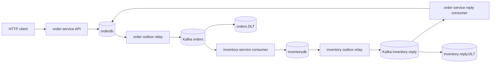
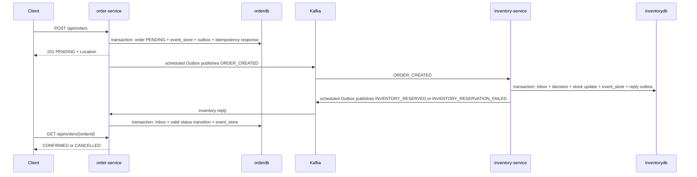

# Kafka Order System

Asynchronous order and inventory reservation demo built with Java 17, Spring Boot,
Kafka and PostgreSQL. The project shows how to accept an order through HTTP,
persist it safely, publish it through an Outbox, reserve real inventory in a
separate database, and finalize the order from an asynchronous inventory reply.

This is a portfolio/demo system, not a production platform. It does not include
Payment, a separate Saga orchestrator service, public deployment, Avro/schema
registry, or exactly-once guarantees.

## Stack and Modules

- `common`: shared JSON event envelope and payload contracts.
- `order-service`: REST API, order persistence, HTTP idempotency, order Inbox,
  event history, order Outbox relay, inventory reply consumer.
- `inventory-service`: order event consumer, real stock reservation, inventory
  Inbox, decision table, event history, inventory reply Outbox relay.
- `kafka-replay-tool`: CLI tool for controlled single-record DLT replay.
- `integration-tests`: Testcontainers suite that runs packaged service jars
  against temporary Kafka and PostgreSQL instances.

Core technologies: Java 17, Spring Boot 3.2.5, Spring Web, Spring Data JPA,
Spring Kafka, Flyway, PostgreSQL, Micrometer, Actuator, Testcontainers, Docker
Compose.

## Architecture



`orderdb` is owned by `order-service`; `inventorydb` is owned by
`inventory-service`. Neither service writes the other service's database.



## Consistency Model

The system uses local ACID transactions plus Outbox/Inbox, not distributed
transactions. Order creation commits before Kafka publication. If Kafka is down,
the order and `PENDING` outbox row remain durable and the relay retries later.

Kafka delivery is treated as at-least-once:

- Consumers use Inbox tables keyed by `eventId`.
- Duplicate messages with the same payload are ignored.
- Duplicate `eventId` with different content is rejected and can go to DLT.
- Inventory also has a per-order decision table to prevent re-reserving stock.
- Order status transitions only allow `PENDING -> CONFIRMED` or
  `PENDING -> CANCELLED`; duplicate matching final replies are harmless and
  conflicting final replies fail.

HTTP idempotency is separate from Kafka deduplication. `Idempotency-Key` on
`POST /api/orders` replays the stored response for the same request fingerprint.
Reusing the key with different order content returns `409 Conflict`. The raw key
is persisted as the idempotency identifier but is not logged.

## Failure Handling

Outbox relays claim bounded batches with a lease, publish with stable aggregate
keys, and mark rows `SENT` only when Kafka acknowledges. Failed sends return to
`PENDING` with exponential backoff until `max-attempts`, then become `FAILED`.
Expired `IN_PROGRESS` claims can be reclaimed after the lease. Callback updates
match the claim token so an old callback cannot overwrite a newer claim.

Kafka consumers use bounded retry and Dead Letter Topics:

| Source topic | Consumer group | DLT |
| --- | --- | --- |
| `orders` | `inventory-group` | `orders.DLT` |
| `inventory-reply` | `order-group` | `inventory-reply.DLT` |

Malformed JSON, unsupported schema versions, invalid payloads and domain
conflicts are non-retryable. Temporary listener failures are retried before DLT.
The replay tool reads one DLT record by topic/partition/offset and republishes
only when `--execute` is supplied. It does not delete DLT records or claim
exactly-once replay.

## Observability

Actuator endpoints exposed by both services:

- `/actuator/health`
- `/actuator/health/liveness`
- `/actuator/health/readiness`
- `/actuator/metrics`
- `/actuator/prometheus`

Sensitive Actuator endpoints such as `env`, `configprops` and `heapdump` are not
exposed.

Readiness policy:

- `order-service`: readiness includes application readiness and database health.
  Kafka is intentionally not a readiness dependency for accepting orders because
  the order Outbox stores work durably while Kafka is unavailable.
- `inventory-service`: readiness includes application readiness, database health
  and Kafka health because its primary role is Kafka consumption.
- Liveness only reflects the running application state, not Kafka or database
  availability.

Custom Micrometer metrics:

HTTP server request timers also publish Prometheus `bucket`, `count` and `sum`
series with bounded SLO buckets for the Grafana p95 latency panel.

| Metric | Type | Labels | Meaning |
| --- | --- | --- | --- |
| `order_orders_created_total` | counter | none | Orders created after transaction commit. |
| `order_status_transitions_total` | counter | `from`, `to` | Committed order status transitions. |
| `inventory_reservations_total` | counter | `result` | Committed inventory reservation decisions. |
| `order_inbox_duplicates_total` | counter | `event_type` | Duplicate inventory replies detected by order Inbox. |
| `inventory_inbox_duplicates_total` | counter | `event_type` | Duplicate order events detected by inventory Inbox. |
| `order_http_idempotency_replays_total` | counter | none | HTTP idempotency replay responses. |
| `order_http_idempotency_conflicts_total` | counter | none | HTTP idempotency conflicts. |
| `*_outbox_publish_attempts_total` | counter | `event_type` | Outbox Kafka send attempts. |
| `*_outbox_publish_success_total` | counter | `event_type` | Outbox rows marked `SENT`. |
| `*_outbox_publish_failures_total` | counter | `event_type`, `outcome` | Outbox publish failures recorded as `PENDING` or `FAILED`. |
| `*_outbox_events` | gauge | `status` | Cached count of Outbox rows by status. |
| `*_outbox_oldest_unpublished_age_seconds` | gauge | none | Cached age of oldest non-`SENT` Outbox row, `0` when none exists. |
| `*_kafka_dlt_publish_total` | counter | `topic`, `result` | DLT producer callback result for DLT topics. |
| `*_kafka_dlt_observed_total` | counter | `topic` | DLT listener observed a DLT record. |

Metrics are process-local observations, not an audit ledger. Counters reset on
restart. Some counters are emitted after commit; a crash between commit and
metric publication can still lose a metric increment. Outbox gauges are refreshed
from bounded aggregate SQL on a schedule instead of querying on every scrape.

Logs include MDC fields `orderId`, `eventId` and `correlationId` on order
creation, Kafka listeners, inventory decisions, Outbox publication callbacks and
order finalization. Full payloads, credentials and raw `Idempotency-Key` values
are not logged intentionally.

## Optional Monitoring

The main development Compose file does not start monitoring. To start Prometheus
and Grafana for a local demo on Windows/Docker Desktop:

```powershell
docker compose -f docker-compose.yml -f docker-compose.monitoring.yml --profile monitoring up -d
```

Prometheus: http://localhost:9090  
Grafana: http://localhost:3000

The Grafana admin user/password in `docker-compose.monitoring.yml` is
`admin/admin` and is development-only. Prometheus scrapes
`host.docker.internal:8081` and `host.docker.internal:8082`, so start both Java
services on their default host ports before expecting data. Alert rules are
examples only; without Alertmanager they do not send notifications.

## Run Locally

Prerequisites:

- JDK 17. Set `JAVA_HOME` to a JDK 17 installation.
- Docker Engine or Docker Desktop with Linux containers.
- Internet access for Maven dependencies and container images on first run.
- Run commands from the repository root. Use the Maven wrapper in
  `order-service`.

Start infrastructure:

```powershell
docker compose up -d
docker compose exec -T postgres-order pg_isready -U admin -d orderdb
docker compose exec -T postgres-inventory pg_isready -U admin -d inventorydb
docker compose exec -T kafka kafka-topics --bootstrap-server kafka:29092 --list
```

Create demo topics:

```powershell
docker compose exec -T kafka kafka-topics --bootstrap-server kafka:29092 --create --if-not-exists --topic orders --partitions 1 --replication-factor 1
docker compose exec -T kafka kafka-topics --bootstrap-server kafka:29092 --create --if-not-exists --topic inventory-reply --partitions 1 --replication-factor 1
docker compose exec -T kafka kafka-topics --bootstrap-server kafka:29092 --create --if-not-exists --topic orders.DLT --partitions 1 --replication-factor 1
docker compose exec -T kafka kafka-topics --bootstrap-server kafka:29092 --create --if-not-exists --topic inventory-reply.DLT --partitions 1 --replication-factor 1
```

Build packaged services:

```powershell
$env:JAVA_HOME='C:\Users\Hossein\.jdks\corretto-17.0.14'
$env:Path="$env:JAVA_HOME\bin;$env:Path"
.\order-service\mvnw.cmd -B -ntp -f pom.xml package
```

Start applications in separate terminals:

```powershell
java -jar inventory-service/target/inventory-service-0.0.1-SNAPSHOT.jar
java -jar order-service/target/order-service-0.0.1-SNAPSHOT.jar
```

Default local ports: Order `8081`, Inventory `8082`, Kafka `9092`, Kafka UI
`8080`, Order PostgreSQL `5432`, Inventory PostgreSQL `5433`, pgAdmin `5050`.
The Compose credentials are local-demo defaults. Do not expose this setup
publicly.

Seed demo stock explicitly:

```powershell
docker compose exec -T postgres-inventory psql -U admin -d inventorydb -c "insert into inventory(product_id, available_quantity, reserved_quantity) values ('product-1', 20, 0) on conflict (product_id) do update set available_quantity = excluded.available_quantity, reserved_quantity = excluded.reserved_quantity;"
```

Create an order:

```powershell
$body = @{ productId='product-1'; customerId='customer-1'; quantity=2; price=12.50 } | ConvertTo-Json
$headers = @{ 'Idempotency-Key' = "demo-order-$(Get-Date -Format yyyyMMddHHmmss)" }
$order = Invoke-RestMethod -Method Post -Uri 'http://localhost:8081/api/orders' -Headers $headers -ContentType 'application/json' -Body $body
$order
Invoke-RestMethod -Uri "http://localhost:8081/api/orders/$($order.orderId)"
```

Useful inspection queries:

```powershell
docker compose exec -T postgres-order psql -U admin -d orderdb -c "select order_id, quantity, status from orders order by created_at desc limit 10;"
docker compose exec -T postgres-order psql -U admin -d orderdb -c "select aggregate_id, status, attempt_count, last_error from outbox_events order by created_at desc limit 10;"
docker compose exec -T postgres-inventory psql -U admin -d inventorydb -c "select product_id, available_quantity, reserved_quantity from inventory order by product_id;"
docker compose exec -T postgres-inventory psql -U admin -d inventorydb -c "select order_id, product_id, quantity, status from inventory_reservation_decisions order by decided_at desc limit 10;"
docker compose exec -T postgres-inventory psql -U admin -d inventorydb -c "select aggregate_id, event_type, status, attempt_count, last_error from inventory_outbox_events order by created_at desc limit 10;"
```

Stop Java processes with Ctrl+C. `docker compose down` preserves PostgreSQL
volumes. Use `docker compose down -v` only when you intentionally want to delete
local demo data.

## Tests and CI

Fast unit and service tests:

```powershell
$env:JAVA_HOME='C:\Users\Hossein\.jdks\corretto-17.0.14'
$env:Path="$env:JAVA_HOME\bin;$env:Path"
.\order-service\mvnw.cmd -B -ntp -f pom.xml test
```

Full verification with Testcontainers:

```powershell
docker info
.\order-service\mvnw.cmd -B -ntp -f pom.xml clean verify
```

`clean verify` runs unit tests plus integration tests that start temporary Kafka
and PostgreSQL containers. It does not use your Compose databases or broker.
Application logs from integration tests are written to
`integration-tests/target/application-logs`. CI runs the same `clean verify` on
Java 17 and uploads Surefire/Failsafe reports and application logs.

## Replay Tool

Build:

```powershell
.\order-service\mvnw.cmd -B -ntp -f pom.xml -pl kafka-replay-tool -am package
```

Dry run:

```powershell
java -jar .\kafka-replay-tool\target\kafka-replay-tool.jar `
  --bootstrap-servers localhost:9092 `
  --dlt-topic orders.DLT `
  --partition 0 `
  --offset 42
```

Execute explicitly:

```powershell
java -jar .\kafka-replay-tool\target\kafka-replay-tool.jar `
  --bootstrap-servers localhost:9092 `
  --dlt-topic orders.DLT `
  --partition 0 `
  --offset 42 `
  --execute
```

Allowed destinations are configured in `ops/replay.properties`.

## Portfolio Summary

Interview explanation:

> This project demonstrates an at-least-once, event-driven order flow. The API
> commits orders and Outbox rows in one local transaction, relays events to
> Kafka, reserves real inventory in a separate service/database, and finalizes
> orders from inventory replies. Duplicate HTTP requests are handled by HTTP
> idempotency; duplicate Kafka messages are handled by Inbox tables and domain
> idempotency. Failures are observable through Actuator health, Prometheus
> metrics, structured correlation logs, DLTs and a controlled replay tool.

Resume bullets:

- Built a Java 17/Spring Boot order workflow using Kafka, PostgreSQL, Flyway,
  Outbox/Inbox, DLT replay tooling and Testcontainers-based recovery tests.
- Implemented real inventory reservation with database-backed idempotency to
  prevent duplicate message effects and overselling under concurrent requests.
- Added Actuator/Micrometer observability with readiness policy, Prometheus
  metrics, Grafana provisioning and correlation-aware logs.

## Current Limitations

- No Payment service, Saga orchestrator service, saga timeout scheduler or
  compensation workflow.
- No schema registry; event contracts are JSON DTOs with compatibility tests.
- No public deployment, secrets management, authentication or TLS.
- DLT replay is operator-driven and single-record only.
- Outbox `FAILED` rows require operator inspection and a controlled reset or
  compensation decision.
- The local Compose environment is development-only.
