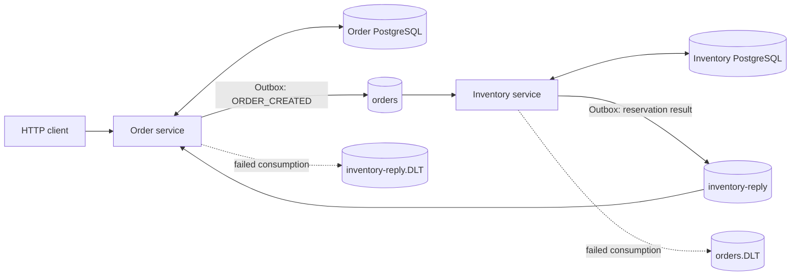
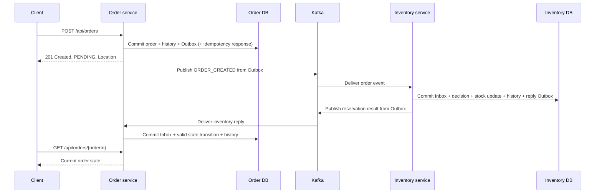

# Kafka Order System

An event-driven order and inventory application built with **Java 17, Spring Boot, Kafka and PostgreSQL**.

The project explores a practical distributed-systems problem: how to accept an order, reserve stock in another service, and recover from failed or duplicate message delivery without repeating business operations.

**Start here:** [Run locally](#run-locally) · [Try the API](#try-the-api) · [Tests](#tests-and-ci) · [Design decisions](#design-decisions)

## What it demonstrates

- **Reliable publication:** transactional Outbox tables, bounded retries, leases and claim tokens in both services.
- **Idempotent processing:** Inbox tables for Kafka events and an optional `Idempotency-Key` for order creation.
- **Concurrent inventory reservation:** conditional database updates and a persistent decision per order.
- **Explicit order transitions:** `PENDING` becomes `CONFIRMED` or `CANCELLED`; conflicting final replies are rejected.
- **Failure recovery:** Dead Letter Topics and a CLI for inspecting and replaying a single record.
- **Operational visibility:** health probes, correlation-aware logs, Prometheus metrics and an optional Grafana dashboard.

This is a portfolio and learning project. Its scope is order creation and stock reservation, with the limitations listed [below](#scope-and-limitations).

## Architecture



Each service owns its database. Neither service writes to the other service's tables. Kafka messages use a shared JSON envelope and an order ID as the record key.

| Module | Responsibility |
| --- | --- |
| [`common`](common) | Event envelope, payload contracts and compatibility fixtures |
| [`order-service`](order-service) | REST API, HTTP idempotency, order state, Inbox and Outbox |
| [`inventory-service`](inventory-service) | Stock reservation, per-order decisions, Inbox and reply Outbox |
| [`kafka-replay-tool`](kafka-replay-tool) | Inspect or replay one selected DLT record |
| [`integration-tests`](integration-tests) | Migration and end-to-end tests using temporary infrastructure |

The Maven reactor uses Spring Boot 3.2.5, Spring Kafka 3.1.4, Spring Data JPA, Flyway and Testcontainers. Docker Compose provides Kafka/Zookeeper, two PostgreSQL databases, Kafka UI and pgAdmin. The Java services run on the host.

### Order lifecycle



Transactions are local to each database. Delivery is **at-least-once**, and consumers must tolerate redelivery. The event history is not an event-sourcing implementation.

## Run locally

### 1. Prerequisites

- JDK 17, with `JAVA_HOME` and `PATH` pointing to it.
- Docker Engine or Docker Desktop using Linux containers, accessible to the current user.
- Git and internet access for the first dependency/image download.

Commands below use **PowerShell** and run from the repository root. On Linux/macOS, use `bash order-service/mvnw` for Maven and adapt the PowerShell API examples to your HTTP client.

```powershell
git clone https://github.com/hosseinkhoshkar/kafka-order-system.git
cd kafka-order-system
java -version
docker info
```

### 2. Build and verify

```powershell
.\order-service\mvnw.cmd -B -ntp -f pom.xml clean verify
```

This runs tests against temporary Testcontainers infrastructure and packages the applications. It requires Docker even before the end-to-end suite: some service and replay tests also start containers. See [Tests and CI](#tests-and-ci) for report locations.

### 3. Start development infrastructure

```powershell
docker compose up -d
docker compose exec -T postgres-order pg_isready -U admin -d orderdb
docker compose exec -T postgres-inventory pg_isready -U admin -d inventorydb
docker compose exec -T kafka kafka-topics --bootstrap-server kafka:29092 --list
```

Startup is asynchronous. If a readiness command fails, wait and repeat it before continuing.

Create the source and dead-letter topics with matching partition counts:

```powershell
$topics = @('orders', 'inventory-reply', 'orders.DLT', 'inventory-reply.DLT')
foreach ($topic in $topics) {
    docker compose exec -T kafka kafka-topics --bootstrap-server kafka:29092 --create --if-not-exists --topic $topic --partitions 1 --replication-factor 1
}
```

### 4. Start both services

Run each command in a **separate terminal**, from the repository root:

```powershell
java -jar inventory-service/target/inventory-service-0.0.1-SNAPSHOT.jar
```

```powershell
java -jar order-service/target/order-service-0.0.1-SNAPSHOT.jar
```

Flyway applies the service's migrations and Hibernate validates the schema. For an existing database created before Flyway, inspect its schema and migration history first; do not enable automatic baselining merely to bypass an error.

```powershell
Invoke-RestMethod http://localhost:8081/actuator/health/readiness
Invoke-RestMethod http://localhost:8082/actuator/health/readiness
```

| Component | Local address/port |
| --- | --- |
| Order API | `http://localhost:8081` |
| Inventory service | `http://localhost:8082` |
| Kafka | `localhost:9092` |
| Order / Inventory PostgreSQL | `localhost:5432` / `localhost:5433` |
| Kafka UI | `http://localhost:8080` |
| pgAdmin | `http://localhost:5050` |

## Try the API

### Seed stock and create an order

Use a unique demo product so repeating the walkthrough does not reset existing stock or reservations. Run the following blocks in the same PowerShell session after both services have started:

```powershell
$productId = 'demo-' + [guid]::NewGuid().ToString('N')
docker compose exec -T postgres-inventory psql -U admin -d inventorydb -v ON_ERROR_STOP=1 -c "insert into inventory(product_id, available_quantity, reserved_quantity) values ('$productId', 20, 0);"

$body = @{
    productId = $productId
    customerId = 'demo-customer'
    quantity = 2
    price = 12.50
} | ConvertTo-Json
$headers = @{ 'Idempotency-Key' = [guid]::NewGuid().ToString() }
$order = Invoke-RestMethod -Method Post -Uri 'http://localhost:8081/api/orders' -Headers $headers -ContentType 'application/json' -Body $body
$order
```

The API returns **201 Created**, a `Location` header and an order in `PENDING`. Publication and reservation happen asynchronously; the initial response does not mean stock has already been reserved.

Fetch the current state, repeating after a few seconds if it is still pending:

```powershell
Invoke-RestMethod -Uri "http://localhost:8081/api/orders/$($order.orderId)"
```

With the seeded stock and healthy services, the expected final state is `CONFIRMED`. Missing or insufficient stock produces `CANCELLED`.

### Repeat the same HTTP request

```powershell
$replayed = Invoke-RestMethod -Method Post -Uri 'http://localhost:8081/api/orders' -Headers $headers -ContentType 'application/json' -Body $body
$replayed.orderId -eq $order.orderId
```

The result should be `True`. A replay returns the stored creation response, including its original `PENDING` status; use GET to see the current state.

| Request | Behavior |
| --- | --- |
| `POST /api/orders` without a key | Creates an independent order |
| Same key and equivalent request | Replays the original response; adds `Idempotent-Replay: true` |
| Same key with different request data | `409 Conflict` |
| Empty/blank key or invalid request | `400 Bad Request` |
| `GET /api/orders/{orderId}` | Returns current state, or `404` if missing |

`quantity` must be a positive integer. `price` is a positive **unit price in EUR**, represented with `BigDecimal`, with at most two decimal places. Product and customer IDs must be nonblank and at most 255 characters. Idempotency keys are trimmed, case-sensitive and limited to 255 characters; records currently have no automatic expiry.

## Reliability and recovery

| Situation | Handling |
| --- | --- |
| Kafka unavailable after order acceptance | Durable Outbox retains work; the relay retries within its configured attempt budget |
| Worker stops after claiming an Outbox row | An expired lease allows another claim; token-checked callbacks protect newer claims |
| Publication succeeds but recording `SENT` fails | Redelivery is possible; Inbox and domain rules prevent repeating business effects |
| Duplicate order event with a new event ID | Inventory reuses its persisted per-order decision when product and quantity match |
| Reply conflicts with a final order state | The state remains unchanged; the consumer rejects the conflict |
| Malformed or permanently invalid message | Consumer recovery publishes it to the configured DLT |

Outbox rows use `PENDING`, `IN_PROGRESS`, `SENT` and `FAILED`. The default relay settings are a batch of 25, a two-minute lease, five attempts and exponential backoff starting at two seconds. Exhausted or permanently invalid rows require operator investigation; recovery is not unlimited.

**Outbox failure and DLT are different:** an Outbox row concerns publication from a database; a DLT record concerns failed Kafka consumption. The replay CLI operates on DLT records, not `FAILED` Outbox rows.

| Source topic | Consumer group | DLT |
| --- | --- | --- |
| `orders` | `inventory-group` | `orders.DLT` |
| `inventory-reply` | `order-group` | `inventory-reply.DLT` |

### Inspect and replay a DLT record

After the root build, inspect an existing record using its actual partition and offset. The offset below is an example:

```powershell
java -jar kafka-replay-tool/target/kafka-replay-tool.jar --bootstrap-servers localhost:9092 --dlt-topic orders.DLT --partition 0 --offset 42
```

The default is **dry-run**. After diagnosing and resolving the cause, append `--execute` to publish the selected record. Destinations are allowlisted in [`ops/replay.properties`](ops/replay.properties). Replay retains the key and payload, does not delete the DLT record, and does not advance application consumer-group offsets. Replaying an unchanged malformed message does not fix it.

## Monitoring

Both services expose `/actuator/health`, `/actuator/health/liveness`, `/actuator/health/readiness`, `/actuator/metrics` and `/actuator/prometheus`.

| Probe | Dependencies |
| --- | --- |
| Liveness | Application liveness and ping; no database or Kafka dependency |
| Order readiness | Application readiness and database; Kafka outages can be buffered by the Outbox |
| Inventory readiness | Application readiness, database and Kafka |

Logs include `orderId`, `eventId` and `correlationId` where available. Metrics cover order creation, reservation outcomes, duplicates, idempotency, Outbox publication/backlog and DLT activity. HTTP latency uses configured SLO buckets for the dashboard's p95 estimate.

Start the optional monitoring stack:

```powershell
docker compose -f docker-compose.yml -f docker-compose.monitoring.yml --profile monitoring up -d
```

- Prometheus: `http://localhost:9090`
- Grafana: `http://localhost:3000` — local demo login: `admin` / `admin`

Prometheus scrapes the host services through `host.docker.internal:8081` and `:8082`; both applications must be running. Provisioned configuration lives in [`ops/prometheus`](ops/prometheus) and [`ops/grafana`](ops/grafana). Alert rules are examples; no notification delivery is configured through Alertmanager.

Counters reset when a process restarts and are not an audit ledger. Outbox gauges are cached database observations and can be stale after a refresh failure.

## Tests and CI

```powershell
# Tests bound to the test phase; includes some Docker-backed tests
.\order-service\mvnw.cmd -B -ntp -f pom.xml test

# Full reactor: tests, packaging, migration and end-to-end verification
.\order-service\mvnw.cmd -B -ntp -f pom.xml clean verify
```

The suites cover API validation, idempotency, event contracts, relay behavior, inventory concurrency/rollback, migrations, replay and the asynchronous order flow. Testcontainers uses temporary Kafka/PostgreSQL instances rather than the Compose databases. A failed Docker connection prevents verification; it is not a successful or skipped test run.

Reports are under each module's `target/surefire-reports` and, where applicable, `target/failsafe-reports`. End-to-end application logs are under `integration-tests/target/application-logs`.

The [GitHub Actions workflow](.github/workflows/ci.yml) runs `clean verify` on Java 17 and uploads reports and application logs. See [workflow runs](https://github.com/hosseinkhoshkar/kafka-order-system/actions/workflows/ci.yml) for the actual result of a particular revision.

## Design decisions

- [Outbox and Inbox](docs/adr/0001-outbox-inbox.md)
- [Order state policy](docs/adr/0002-order-state-policy.md)
- [HTTP idempotency and replay](docs/adr/0003-idempotency-and-replay.md)
- [Observability and readiness](docs/adr/0004-observability-readiness.md)
- [Extended demo walkthrough](docs/demo-10-minute.md)

## Scope and limitations

- No payment processing, reservation compensation, Saga timeout handling or public deployment.
- No authentication, TLS or production secrets management. Compose credentials are development defaults; keep this environment local.
- JSON contracts and compatibility fixtures are used without a schema registry. Delivery is not exactly-once.
- Replay is an explicit, single-record operation. Failed Outbox rows need a separate operational decision.
- The development broker is a single instance without a configured persistent Kafka volume; container recreation can lose broker data. PostgreSQL uses named volumes.

Stop Java processes with Ctrl+C. Stop infrastructure using `docker compose down`; if monitoring is active, use the same Compose files and profile used to start it. PostgreSQL volumes survive normal shutdown. **Adding `-v` deletes those volumes and their data.**
